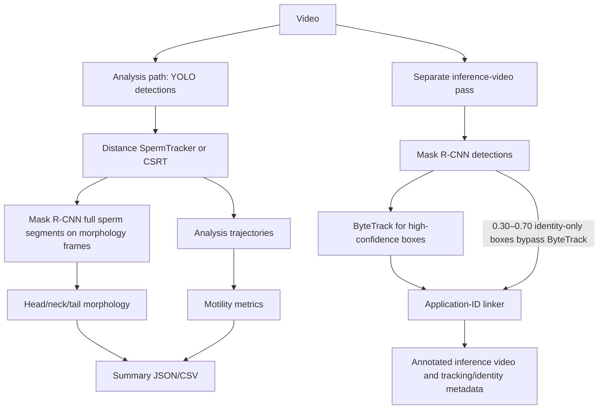

# Garbha AI — IVF Intelligence Platform and Sperm Analysis

## 1. Garbha AI — Overall Platform

Garbha AI describes an AI-powered fertility and IVF technology platform for decision support across the IVF workflow. Its official technology page presents embryo assessment as the clinically deployed core and describes sperm assessment, oocyte assessment, endometrial receptivity and broader clinic/lab workflow intelligence as extensions across the cycle. Published maturity differs by module and does not establish what this repository implements.

| Module | Platform purpose | Status stated by Garbha AI |
| --- | --- | --- |
| EmbryoScore | Embryo grading and developmental assessment | Flagship, live in clinics; the page states 11 partner clinics and 93% embryo-selection accuracy. |
| Sperm Quality Assessment | Motility, velocity/linearity and morphology to support ICSI candidate selection | In validation. |
| Oocyte Quality Assessment | Oocyte maturity/quality features | In build. |
| Garbha ERA | Endometrial receptivity / transfer-window assessment | In build. |
| Non-Invasive PGT-A | Image-based aneuploidy risk assessment | Roadmap. |
| Smart IVF | Real-time IVF analytics and lab/clinic workflow coordination | Listed as a solution; maturity not stated on the technology page. |

## 2. Garbha AI Technology Approach

The official site describes edge inference on incubator and microscope hardware, including ESCO time-lapse devices, without cloud dependency; explainability through Grad-CAM heatmaps and morphokinetic annotations; platform research fusing images with clinical history; and decision support across IVF touchpoints. These are Garbha AI platform statements only. This repository does not verify on-device deployment, data residency/privacy architecture, Grad-CAM, clinical-history fusion, or hardware integration. **Not verified from the current implementation.** [Garbha AI technology](https://garbha.ai/technology) · [Sperm solution](https://garbha.ai/solutions/sperm-selection) · [Smart IVF](https://garbha.ai/solutions/smart-ivf)

## 3. Platform and Repository Boundary

This repository implements a sperm video-analysis service. It does not contain the other listed Garbha AI platform modules based on the current checkout. The website describes Garbha AI’s sperm solution as in validation; this code alone does not verify that validation or clinical deployment status. The sperm solution page mentions vitality and DNA integrity, neither of which is verified in this repository. Website-derived platform claims and repository implementation details are kept separate.

## 1. Project Overview

This repository provides a video analysis pipeline and FastAPI service for sperm detection, tracking, morphology and motility summaries, and annotated output videos. The main implementation is in `sperm_pipeline/sperm_pipeline/`; `main.py` exposes the service.

The code still has separate detector/tracker internals, but uploaded-video outputs now use one canonical video-local identity:

- **Detection** finds image regions and gives each observation a confidence, box, and center. The analysis path uses YOLO; the inference-video path uses Mask R-CNN.
- **Analysis tracking** runs YOLO with `SpermTracker` (or CSRT) for diagnostics. Its internal IDs are not used as uploaded API/CASA identities.
- **Canonical uploaded identity** is `application_id`: the default inference linker associates Mask R-CNN observations and ByteTrack tracks, draws that ID, and supplies the trajectories and result-row `sperm_id`.
- **Morphology** for uploaded analysis is computed from the accepted inference mask and stored under that same `application_id`. In CSRT mode, the CSRT video-path ID is exported as `application_id` and used consistently for uploaded results.

The processed video, inference video, JSON/CSV summaries, trajectories, and inference identity diagnostics are saved under the per-job output directory. No biological sperm count is calculated from the maximum application ID.

## 2. Pipeline Architecture



| Identifier | Assigned by | Meaning |
|---|---|---|
| Detection | Detector | A per-frame observation; it is not a persistent ID. |
| ByteTrack ID (`tracker_id`) | ByteTrack during the default inference-video path | A tracker-local track. ByteTrack may lose, split, or change it. |
| Analysis `track_id` | `SpermTracker` or analysis `CSRTSpermTracker` | Diagnostic identity for the separate YOLO analysis pass; not the uploaded biological identity. |
| `application_id` | Inference linker; CSRT inference track in CSRT mode | Canonical uploaded video-local identity used by the annotated inference video, trajectories, morphology, motility/CASA, and API `sperm_id`. |

ByteTrack remains an internal association ID in the default path. The analysis tracker ID is diagnostic only. Live-camera sessions retain their own video/session-local track IDs.

## 3. Application-ID Objective

The application linker targets:

```text
SAME PHYSICAL SPERM     -> SAME APPLICATION ID
DIFFERENT PHYSICAL SPERM -> DIFFERENT APPLICATION IDs
```

Correct identity matters more than minimizing the number of IDs. An **ID switch** transfers an existing identity to a different physical sperm. **Fragmentation** gives one physical sperm multiple IDs at different times. **Reassociation** reconnects a later observation to an existing identity. **Occlusion** is a period where a sperm is hidden or detections merge. **Re-identification** attempts to recover a prior identity after it disappears. An **ambiguous association** means the evidence does not distinguish candidates. Fragmentation and switching are different errors; a conservative unassigned frame is preferable to a confident wrong assignment.

Feature status labels used below: **IMPLEMENTED** means present in current code; **TESTED** means a corresponding repository test exists; **EXPERIMENTAL** means tested behavior is not evidence of real-video robustness; **PLANNED** means absent from the implementation; **KNOWN LIMITATION** identifies an unresolved risk.

## 4. Current Confidence Logic

| Purpose | Current value | Source / behavior |
|---|---:|---|
| YOLO detection confidence | `0.25` | `SpermDetector` default; YOLO analysis path. |
| ByteTrack `track_high_thresh` / `new_track_thresh` | `0.25` / `0.25` | Inference path config. |
| ByteTrack `track_low_thresh` | `0.10` | Inference path config; weak identity boxes do not enter ByteTrack. |
| Inference Mask R-CNN high detection gate | `score >= 0.45` and `score > 0.70` | Effective application-linker high gate is strictly `> 0.70`; `0.45` is redundant under the current morphology gate. |
| Inference application high-confidence threshold | `0.70` | `MORPHOLOGY_THRESHOLD` constant; high application observations require strictly greater than this. The segmentation threshold is also `0.70` by default/config, but this linker gate comes from the pipeline constant. |
| Low-score minimum and maximum | `0.30` and `0.70` inclusive | Low observations are candidates for identity support only. |
| Low-score max distance | `40 px` | Both latest-observation and trusted-anchor distance must be within the gate. |
| Low-score minimum IoU | `0.30` | Both latest-observation and trusted-anchor IoU must meet the gate. |
| Consecutive low identity-support cap | `3` frames | A fourth consecutive supported frame is rejected; a frame gap resets the count. |
| Low-score ambiguity margin | `0.10` candidate-cost units | Equal/near-equal candidates within the margin are rejected. |
| High continuation max gap | `10` frames for ordinary continuation | Past 10 frames, same-ByteTrack continuation may continue within the source-FPS-derived 3.0-second recovery window. |
| High reassociation max gap | `10` frames | Distance limit `18 + 5 × (gap − 1) px`; max side ratio `2.0`. |
| Occlusion/lost pool maximum | `3.0` seconds converted to source frames | Identities beyond the gap are terminated. |
| Occlusion re-identification distance | `min(100, 20 + 7 × gap) px` | Both anchor and predicted distances must fit; size and motion checks also apply. |
| Occlusion re-identification ambiguity margin | `0.10` | Candidate cost difference at or below the margin is ambiguous. |

The application linker processes inference frames independently of `frame_skip`, which is used in the analysis pass. The inference-video path falls back to 30 FPS only if the input FPS is missing/invalid for video generation/ByteTrack initialization; analysis motility calculation rejects invalid FPS.

## 5. High-Confidence Identity Matching

**IMPLEMENTED; TESTED** for selected deterministic cases. The linker reserves each detection and each application ID at most once.

1. **Same ByteTrack ID continuation:** the ByteTrack ID must map to that application ID. For gaps 1–10, a non-opposing motion check is required; center distance is accepted within `45 + 8 × (gap − 1) px`, or within `80 + 12 × (gap − 1) px` when IoU is at least `0.20`. With established velocity, predicted distance must be within the close-distance limit. For gaps 11–30, distance must be at most `min(100, 20 + 7 × gap) px`; established motion must also fit the predicted-distance bound.
2. **High-confidence reassociation:** only gaps 1–10 are considered. Distance must be at most `18 + 5 × (gap − 1) px`; long-side ratio must be at most `2.0`; motion must not oppose established velocity; and, for a moving identity, predicted distance must also fit the distance limit. For a one-frame gap, if IoU is below `0.10`, distance must be at most `12 px`.
3. **One-to-one reservation:** continuation is resolved first; high-confidence reassociation builds a gated cost matrix and uses Hungarian assignment when SciPy is available. Near-equal candidate claims remain unassigned.
4. A changed ByteTrack ID may reassociate to an existing application ID. For reassociation, the old velocity is cleared rather than inferred from an untrusted jump; a later validated continuation can establish new velocity.

These are multiple gates, not a simple `distance <= 80 OR IoU >= 0.30` rule.

## 6. Low-Confidence Identity Support

**IMPLEMENTED; TESTED** in the inference linker. Scores from `0.30` through `0.70` inclusive can support an existing identity but cannot create one. They carry `identity_only = true` and `morphology_valid = false`.

The geometry gate accepts when **either** (a) both latest-observation and trusted-anchor distances are at most `40 px`, or (b) both corresponding IoUs are at least `0.30`. It rejects when at least one distance exceeds 40 px **and** at least one IoU is below 0.30. It is also rejected when the support cap is reached, established motion opposes the candidate, or predicted distance from the trusted motion state exceeds `40 px` while speed exceeds `1 px/frame`.

At most three consecutive supported frames are allowed. A skipped frame resets the consecutive count. A high-confidence continuation, reassociation, or occlusion recovery resets support. An ambiguous low candidate remains unassigned. Low-score boxes are rendered/labeled only when accepted as identity support.

## 7. Assignment Priority

**IMPLEMENTED; TESTED**. Current order in `_link_inference_application_ids` is:

1. High-confidence continuation
2. High-confidence reassociation
3. High-confidence occlusion re-identification
4. Low-confidence identity support
5. New application IDs for remaining eligible high-confidence detections

The occlusion-reidentification stage is an additional high-confidence priority step between reassociation and low support. High-confidence candidates reserve identities first so weak observations cannot consume an identity needed by stronger evidence.

## 8. Ambiguity Handling

**IMPLEMENTED; TESTED** for low-confidence competition, crossing, and selected re-identification scenarios. For low support, the best and second-best candidate costs are compared; a difference `<= 0.10` is rejected. Occlusion re-identification uses the same numeric margin on its own candidate cost. A high detection blocked as an ambiguous occlusion re-identification does not receive a new ID in that frame.

One detection cannot be assigned to multiple IDs, and one ID cannot be assigned to multiple detections. Merged boxes covering at least two trusted high-confidence centers are blocked and mark those identities occluded. Crossings with insufficient evidence are intended to remain unassigned. The preference is **UNASSIGNED / TEMPORARILY LOST** over **WRONG ID**.

## 9. Trusted High-Confidence Anchor

**IMPLEMENTED; TESTED**. Identity state separately stores latest observation (`last_observation_*`) and trusted high-confidence state (`last_high_conf_*`). Low support updates the latest observation and support count but does not update the trusted high-confidence center, box, or frame. Motion and low-score eligibility check both latest and anchor geometry; low-score matching also checks the predicted center. This bounds weak-reference drift.

For example, a high-confidence observation at `x=100` followed by weak observations at `125`, `150`, and `175` cannot keep chaining validity solely from each preceding weak point: each candidate remains constrained by the trusted anchor and its 40 px limit.

## 10. ByteTrack Isolation

**IMPLEMENTED; TESTED**. The inference pass constructs ByteTrack detections from only the high-score Mask R-CNN arrays (`boxes`, `scores`, and labels). Boxes in the `0.30–0.70` support range are kept in separate arrays and never enter ByteTrack, its mask smoother, or its regular detection overlay. They are passed only to application-ID support matching and drawn if accepted.

`ByteTrack ID != biological/application ID`. The application linker keeps an owner mapping and can associate an identity across a ByteTrack ID change; its lifecycle records old and new ByteTrack IDs during recovery.

## 11. Overlap / Occlusion Problem

**KNOWN LIMITATION; VALIDATION REQUIRED.** The linker includes a merged-box block and recently lost/occluded re-identification, but overlap/occlusion recovery is not proven solved on representative videos. High sequential IDs are not a physical count; they can result from fragmented identities.

Likely failure sequence:

```text
confirmed sperm → overlap/merged detection → detector or ByteTrack loses its track
→ prior application ID becomes unavailable or recovery is rejected
→ sperm separates and is detected again → reassociation fails or is ambiguous
→ a new application ID is created
```

Code marks merged detections when a high-confidence box contains two or more trusted centers, blocks that box, retains `OCCLUDED`/`LOST` identities for up to 3.0 seconds at source FPS, and tries motion/size-aware re-identification before making new IDs. This feature is implemented and has synthetic coverage; production overlap recovery remains unvalidated after this change.

## 12. ID Number vs Sperm Count

> **MAXIMUM APPLICATION ID IS NOT SPERM COUNT.**

`128` physical sperm does not imply maximum application ID `<= 128`. IDs are minted over time; fragmentation can produce a maximum such as `186` while fewer sperm are present.

- **Current visible sperm:** detections/observations in a particular frame; ambiguous or filtered objects can be absent.
- **Unique application IDs:** identities minted by the inference linker over the video, including fragmented identities.
- **Maximum numeric ID:** the last sequential ID allocated, not a biological count.
- **Actual/estimated biological sperm count:** not calculated by this application-ID code.

The uploaded analysis summary creates one row per canonical uploaded identity trajectory (`sperm_id == application_id`). Live `active_count` remains a count of live-session tracker identities. Neither value is a verified physical sperm count. No `max(application_id)` count appears in the inspected reporting code. Distinct IDs created over a video include fragments and are not a biological count.

## 13. Occlusion / Re-identification Design

**IMPLEMENTED; TESTED synthetically; real-video behavior EXPERIMENTAL.** The inference identity states include `CONFIRMED`, `OCCLUDED`, `LOST`, `IDENTITY_SUPPORTED`, and `TERMINATED`; lifecycle JSON records `ID_OCCLUDED`, `ID_LOST`, `ID_REIDENTIFIED`, `ID_CONFIRMED`, and `ID_TERMINATED` events. The implemented recovery lifecycle is:

```text
CONFIRMED → OCCLUDED or LOST → REIDENTIFIED → CONFIRMED
                         └── after >3.0 seconds → TERMINATED
```

The recent pool uses last trusted center/box/frame, smoothed velocity from recent trusted high-confidence history, predicted position, frame gap, bbox side ratio, and remembered overlap partners. A candidate must pass size, motion, distance, and ambiguity checks. If these do not disambiguate candidates, it stays unassigned. `overlap partners` are tracked, but no appearance/re-identification embedding is present. Further real-video validation and tuning remain necessary.

## 14. New-ID Creation

**IMPLEMENTED; TESTED**. A new application ID is created only for a remaining unreserved, unblocked high-confidence detection (`score > 0.70`). Low observations never mint IDs. Before creation, the linker attempts continuation, reassociation, and occlusion re-identification. An ambiguous occlusion-recovery candidate is blocked from new-ID creation for that frame. Otherwise a new ID is sequentially allocated and its reason is recorded (for example `TRUE_NEW_ENTRANT`, `NO_PREVIOUS_CANDIDATE`, or an applicable failed recovery reason).

The lifecycle is designed to check recently lost identities before treating a post-occlusion detection as new, but failed gates or unresolved detector errors can still fragment identity.

### Video-local identity registry and quality artifacts

Each uploaded inference pass creates a fresh `SpermIdentityRegistry`. It owns a monotonic `application_id` sequence and retains a record for each ID for the rest of that video. `identity_capacity` is optional and is `None` for production uploads because this repository has no independently validated physical-cell count. IDs are never recycled, capped, or derived from ByteTrack IDs.

The registry retains the latest and trusted high-confidence box/center separately, velocity and bounded trajectory history, lifecycle state, low-support count, and the sequence of ByteTrack IDs associated with the identity. Lifecycle state is one of `CONFIRMED`, `LOW_SUPPORT`, `OCCLUDED`, `LOST`, `UNRESOLVED`, or `TERMINATED`. Weak observations can support an identity under the existing gates but do not replace its trusted anchor or enter morphology/CASA trajectories.

Merged detections that contain multiple trusted identity centers are left unlabeled and mark those identities occluded. The linker retains a pre-overlap snapshot and partner IDs, then evaluates eligible lost/occluded identities together with one-to-one Hungarian assignment. Near-tied per-detection, per-identity, or overlap-group assignments remain unresolved. High-confidence detections near recent lost/occluded identities are held as unresolved candidates for a bounded source-FPS-based period before they can create a new ID. No appearance/ReID model is used, so complete indistinguishable occlusion can remain unresolved.

The inference path writes these per-video artifacts under `meta/`:

| Artifact | Contents |
|---|---|
| `application_identity_registry.json` | Registry capacity (`null` in production), allocated identity count, lifecycle state, trusted/latest geometry, trajectory history, and ByteTrack ID history. |
| `tracking_quality_summary.json` | Video properties, created IDs, maximum simultaneous assigned IDs, lost/occlusion/recovery counts, same-ByteTrack splits, ambiguity/unresolved counts, heuristic fragmentation/switch flags, and track-length statistics. |
| `overlap_identity_review/` | Up to 20 before/during/after contact sheets with application ID, ByteTrack ID, and observed trajectory direction, plus an index. |

`POSSIBLE_ID_FRAGMENTATION` and `POSSIBLE_ID_SWITCH` are diagnostic heuristics only; they do not merge identities or establish physical identity. The quality summary counts assigned inference observations, not physical sperm. The `/results/{job_id}` response exposes links to the quality summary and registry; the review sheets are files within the job output tree.

## 15. Morphology Isolation

Morphology is computed in the analysis pass by matching YOLO detections to full-sperm Mask R-CNN segments and then segmenting head, neck, and tail regions. The analyzer measures head axes, area and circularity; skeletonized tail length; and a neck angle derived from head centroid and tail geometry. Default normality criteria in `MorphologyAnalyzer` are circularity `>=0.70`, head length `5–60 px`, width `3–40 px`, neck angle `<=45°`, and tail length `>=15 px`. A morphology frame is selected every `morph_every_n` frames (default `5`).

The inference linker’s `morphology_valid` is metadata for score eligibility (`score > 0.70`); it is not a guard around the analysis morphology function. Low identity-support boxes explicitly have `morphology_valid=false` and are not described as morphology-confirmed. The analysis morphology pass uses its own YOLO/segment matching and does not consume those low-score inference-only boxes.

## 16. CSRT

**IMPLEMENTED; TESTED separately.** Select `tracking_method = csrt` to use CSRT in the dedicated inference-video path. The ID drawn by that path is exported as `application_id` and supplies uploaded trajectories, morphology, and result rows. CSRT still performs detector corrections and prediction validation internally; its IDs remain implementation details outside that uploaded video.

The inference application-ID linker changes described above apply to the default Mask R-CNN + ByteTrack video pass; do not assume they modify CSRT. Relevant regression coverage is in `tests/test_csrt_identity.py`, including invalid CSRT boxes, detector misses, recovery, crossings, drift, and new-ID behavior. CSRT requires an OpenCV build with CSRT available; the code raises an error instead of silently falling back.

## 17. Identity Diagnostics

The default inference-video pass writes these files under `meta/`:

| File | Contents |
|---|---|
| `identity_assignment_diagnostics.json` | Candidate frame/index, detector score, ByteTrack and candidate application IDs, distances and IoUs to latest observation/trusted anchor, predicted distance, frame gap, centers/boxes, candidate costs, assignment type, accepted/ambiguous flags, and rejection reason. |
| `low_score_identity_diagnostics.json` | Low-score frame, candidate track, score, distance, IoU, support count, accepted/reason, `identity_only`, `morphology_valid`, and whether identity later returned to high confidence. |
| `application_id_lifecycle.json` | Identity create/confirm/lost/occluded/reidentified/terminated events and associated frame, IDs, and recovery details. |
| `inference_tracking.csv` | Accepted per-frame records: frame/time, ByteTrack ID, application ID, class, confidence, center, box, mask area, and identity/morphology flags. |

Inference assignment type names include `HIGH_CONTINUATION`, `HIGH_REASSOCIATION`, `LOW_IDENTITY_SUPPORT`, `NEW_HIGH_ID`, `AMBIGUOUS_REJECT`, and `LOW_REJECT`; occlusion recovery additionally uses `OCCLUDED_REIDENTIFICATION`. Analysis `SpermTracker` writes `analysis_id_diagnostics.json` with candidate geometry, prediction, assignment cost, ambiguity, and decision reason. Diagnostics cannot prove physical identity when detections themselves are merged or missing. CSRT diagnostics are separate.

`application_identity_registry.json` records per-video canonical identity state and ByteTrack history; it is not a sperm-count estimate. `tracking_quality_summary.json` contains counts computed from assigned output observations and heuristic fragmentation/switch flags. `overlap_identity_review/` contains up to 20 event contact sheets when overlap lifecycle events were detected. Observations held unresolved are not rendered with a fabricated ID and do not enter canonical trajectories or CASA.

## 18. Testing

The repository includes:

- `tests/test_inference_identity_linker.py`: high-vs-low priority, no duplicate assignments, low-score ambiguity and 40 px / IoU 0.30 gate cases, three-frame cap, high-confidence reset, skipped-frame reset, trusted-anchor drift, motion jump rejection, merged-box handling, synthetic occlusion recovery and crossing, and low-score ByteTrack input isolation.
- `tests/test_uploaded_identity_contract.py`: inference application IDs key uploaded trajectories/API rows/CASA; identity-only points are excluded; CSRT tracker IDs map into the application namespace.
- `tests/test_csrt_identity.py`: CSRT miss bridging, rejected predictions, recovery windows, ambiguity/crossing, drift protection, motion prediction, and ID lifecycle.
- `tests/test_casa_metrics.py`: calibrated and uncalibrated CASA velocity calculations, frame-gap timing, calibration scaling, and invalid FPS handling.

Run the focused suites with:

```bash
python -m pytest -q tests/test_inference_identity_linker.py
python -m pytest -q tests/test_csrt_identity.py
python -m pytest -q tests/test_casa_metrics.py
```

The full repository suite passes 65 tests after the uploaded identity consolidation. Synthetic tests establish code-path consistency and selected association behavior; they do not establish physical identity accuracy on production microscopy videos.

## 19. Known Limitations

- Overlapping sperm and long occlusions can still cause fragmentation; real-video recovery is under validation.
- A merged detector box can be blocked if it contains multiple trusted centers, but detector merges that do not satisfy that geometric rule may still pass or remain unresolved.
- Visually similar sperm crossing after a long disappearance may be ambiguous; the inference linker has motion and geometry, not visual appearance embeddings.
- ByteTrack fragmentation remains possible. The application layer can bridge some ID changes but has bounded frame and geometry gates.
- Reassociation after more than 3.0 seconds is terminated by the inference lifecycle; a later high-confidence detection can become a new ID.
- Low-score support uses raw Mask R-CNN boxes and scores, while high observations use boxes matched to ByteTrack tracks. Differences in geometry can make low/high transition matching fail.
- The diagnostic analysis pass still has a separate internal tracker ID, but uploaded results no longer use it. Uploaded outputs share `application_id`.
- `meta/trajectories.json` writes the source video FPS. Final motility computation also uses the source video FPS.
- Motility classification documents legacy pixel-based thresholds in code; it is not a clinically validated calibration unless a measured micrometers-per-pixel scale is configured.

## 20. Debugging ID Switching

For an ID change, inspect `meta/inference_tracking.csv`, `meta/identity_assignment_diagnostics.json`, and `meta/application_id_lifecycle.json` around the affected frames. Record:

1. Last frame with the correct application ID
2. First frame where identity is lost
3. Whether overlap or a merged detection occurred
4. Detector confidence
5. ByteTrack ID before and after
6. Application ID before and after
7. Assignment type and rejection reason
8. Distance to latest observation
9. IoU to latest observation
10. Predicted distance
11. Distance to trusted high-confidence anchor
12. Ambiguity status and best/second candidate scores
13. New-ID reason and lifecycle event

Classify the event carefully:

- **ID switch:** an existing ID moved to a different physical sperm.
- **Fragmentation:** the same physical sperm later received a newly minted ID.
- **Temporary loss:** no ID was assigned for a period, then the original ID was recovered.

An absent CSV row can mean the linker rejected/blocked the detection or upstream detection/tracking did not provide a usable observation; correlate with diagnostics and the video before assigning a cause.

## 21. Output Files

For a video job, `process_video` writes into its supplied job directory:

```text
<job-dir>/
├── output_processed_video.mp4       # codec/container may be converted from AVI
├── output_inference_video.mp4       # annotated Mask R-CNN + ByteTrack/app IDs, or CSRT path
└── meta/
    ├── summary.json
    ├── summary.csv                  # when pandas is installed
    ├── trajectories.json
    ├── inference_tracking.csv
    ├── identity_assignment_diagnostics.json       # default inference path
    ├── low_score_identity_diagnostics.json        # default inference path
    ├── application_id_lifecycle.json              # default inference path
    ├── application_identity_registry.json         # inference and CSRT paths
    ├── tracking_quality_summary.json              # inference and CSRT paths
    ├── overlap_identity_review/                   # event contact sheets and index
    ├── csrt_tracking_diagnostics.json             # CSRT analysis path
    └── csrt_inference_diagnostics.json            # CSRT inference path
```

The implementation first writes AVI files for videos and attempts H.264 conversion; if conversion is unavailable, the actual returned video path can retain its AVI extension. CSRT diagnostic files exist only when the selected tracker exposes diagnostics. `summary.json` contains per-analysis-track status, morphology/motility scores and features, units, calibration warnings, and explainability. `summary.csv` is a compact summary. `trajectories.json` stores analysis track points `(frame, x, y)`.

## 22. Development Safety Rules

Do not optimize tracking by minimizing unique ID count alone. Prioritize:

1. Prevent sperm-to-sperm ID transfer
2. Preserve biological identity
3. Recover after short detector loss
4. Recover after overlap/occlusion
5. Reduce fragmentation

A temporarily lost/unassigned track is safer than assigning the wrong sperm's ID. ByteTrack and the diagnostic analysis tracker IDs remain separate internal namespaces; uploaded outputs use `application_id` throughout.

## 23. Current Development Status

- **IMPLEMENTED IN THIS CHANGE:** Uploaded video labels, summary `sperm_id`, trajectories, morphology, and CASA now use the same application identity. High-confidence reassociation uses global assignment and ambiguity rejection; same-ByteTrack continuation can tolerate a direction reversal when box and predicted-position evidence strongly agree. Lost identity lifetime is expressed as 3.0 seconds at source FPS.
- **TESTED:** Deterministic synthetic identity and API/CASA key-consistency tests. These do not establish production video identity accuracy.
- **REAL-VIDEO STATUS:** The latest recorded run had 359 distinct application IDs and many application-linker fragments. A replay after this change is still required; no production accuracy improvement is claimed yet.
- **KNOWN LIMITATION:** There is no learned appearance model. If overlapping sperm yield a merged/unstable detector observation or equal motion/geometry candidates, recovery can remain unresolved; manual identity ground truth is needed to measure true switches.

## Repository Notes

Configuration is read by `main.py` with environment variables taking precedence over `config.ini` and code defaults. Do not put credentials, patient data, or environment secrets in this README. The configured API key and environment values are intentionally not reproduced here.
# Garbha AI Platform and Sperm Analysis — Implementation Reference

The opening section of this README describes Garbha AI at the platform level. Technical implementation statements below are based only on this repository. The official technology page distinguishes EmbryoScore (flagship live in clinics), Sperm Quality Assessment (in validation), Oocyte Quality Assessment and Garbha ERA (in build), and Non-Invasive PGT-A (roadmap). Smart IVF is presented as cross-workflow analytics; its maturity is not specified there. Garbha describes edge inference on incubator/microscope hardware, data remaining in the lab, Grad-CAM heatmaps and morphokinetic annotations, clinical-history/image research, and hardware integration. Those are official platform descriptions, not verified properties of this codebase. [Official technology page](https://garbha.ai/technology) · [Sperm solution](https://garbha.ai/solutions/sperm-selection) · [Smart IVF](https://garbha.ai/solutions/smart-ivf)

The sperm solution page describes motility, morphology, and vitality assessment, but this repository does not establish vitality scoring or DNA integrity analysis. The current implementation documents below include its own pixel-based morphology features and motion metrics; do not conflate those with the platform page claims.

## Sperm module implementation details

### Detection and pipeline paths

The diagnostic analysis pass reads frames with OpenCV and runs YOLO with `SpermTracker` or CSRT. The inference pass runs Mask R-CNN, sends high-score boxes into Ultralytics ByteTrack, and sends lower-score boxes to the identity-support path. Its application linker assigns the canonical uploaded `application_id`; the same accepted masks feed morphology, high-confidence bbox centers feed CASA trajectories, and the same IDs are drawn and returned as API `sperm_id` values. ByteTrack and diagnostic analysis IDs are not exposed as uploaded biological identities.

YOLO detector confidence defaults to 0.25. The service defaults to full-frame inference; optional sliced inference uses 320-pixel tiles, 0.25 overlap, and cross-tile NMS IoU 0.45. Boxes are translated back to frame coordinates and clipped. YOLO detections are not class-filtered in SpermDetector. The shipped default model path in main.py is detection_best.pt; the correct scientific provenance of model binaries is **Not verified from the current implementation.**

Inference Mask R-CNN filters to configured sperm labels (service default label ID 2, with segmenter fallback based on class-name metadata or label 1). Scores below 0.30 are ignored; 0.30 through 0.70 are low-score identity candidates; high-confidence linker observations require score strictly above 0.70 (and at least 0.45). The ordinary segmenter accepts scores strictly above its configured threshold, default 0.70. This threshold behavior means 0.70 itself falls in the identity-only bucket for the linker.

### Tracking and identity

The diagnostic `SpermTracker` predicts from up to five recent frame-indexed observations, gates candidate pairs by predicted/last-center distance, bbox overlap and size, and motion direction, then uses Hungarian one-to-one assignment when SciPy is available. It does not assign uploaded API/CASA identities. Recently lost/occluded analysis-diagnostic tracks remain eligible for up to 10 source frames; its named pixel gates are not calibrated for all microscopes/videos. CSRT is an alternate tracking implementation in the inference-video path when selected; its tracker IDs map to the uploaded application-ID namespace.

The inference BYTETracker parameters are track_high_thresh=0.25, track_low_thresh=0.10, new_track_thresh=0.25, track_buffer=40, match_thresh=0.75, fuse_score=true. **ByteTrack ID ≠ Biological Sperm ID.** The downstream application-ID linker maps a tracker ID to a video-local application ID and can recover the latter after a ByteTrack ID changes.

The inference application-ID priority is: (1) high-confidence same-ByteTrack continuation, (2) high-confidence reassociation to a lost identity, (3) occluded/lost identity re-identification, (4) low-confidence identity support, and (5) new ID for eligible unmatched high-confidence detection. One detection and one application ID can be reserved only once in a frame.

For same-ByteTrack continuation, gaps through 10 frames use the existing close/overlap distance gates. Motion disagreement is tolerated only when actual and predicted positions plus box overlap strongly support continuity. A longer same-ByteTrack gap may continue within the source-FPS-derived 3.0-second recovery window under the existing distance and prediction gates. Different-ByteTrack reassociation allows up to 10 frames under the existing geometry/motion gates, then uses gated global one-to-one assignment. Near-equal assignment alternatives are left unassigned.

Occlusion re-identification keeps lost/occluded identities eligible for up to 3.0 seconds based on source FPS. It compares trusted position and motion prediction under existing distance and side-ratio gates and rejects near-tied candidate costs. If two identities' trusted centers fall inside one high-confidence merged box, the box is blocked, both IDs become OCCLUDED, and overlap partner IDs are recorded. Ambiguous recovery stays unassigned. This behavior has synthetic coverage; production video replay is required to assess real microscopy performance.

Low-score detections from 0.30–0.70 are identity-only: they cannot create application IDs, enter ByteTrack, or be morphology-valid. Fields set in code are identity_only=true and morphology_valid=false. Low-score support allows at most three consecutive frames; skipped frames reset the streak. Distance-to-last and distance-to-trusted-anchor must both be at most 40 pixels, or both corresponding IoUs must be at least 0.30. Movement opposing established velocity and predictions beyond 40 pixels are rejected. Near-equal candidate cost margin is 0.10. Low-score observations do not move the trusted high-confidence anchor; high-confidence recovery resets the counter.

The latest observation and trusted high-confidence observation are stored separately. High-confidence assignments update trusted center, box, and motion state; weak observations can maintain short-term step continuity without moving the trusted anchor. The anchor can still be wrong following a bad high-confidence detector output.

**MAXIMUM APPLICATION ID IS NOT SPERM COUNT.** Application IDs are sequence labels: fragmentation can make the maximum larger than the number of physical sperm, while missed/unassigned observations can undercount. The uploaded summary and `trajectories.json` use canonical application-ID trajectories; the inference CSV records accepted observations. No validated physical sperm-count estimator is implemented or verified.

### Morphology and motility

Segmentation reconstructs torchvision Mask R-CNN ResNet-50 FPN from the configured checkpoint; the service default is best_resnet50_transfer_from_101.pth. HNK_best.pt is the configured head/neck/tail path. HNK model provenance and class semantics are **Not verified from the current implementation.** The segmenter tries TorchScript/callable HNK inference and falls back to heuristic subpart segmentation if loading fails or gives a non-callable state dict. Uploaded morphology runs every fifth frame by default, uses the accepted inference mask, and stores measurements under its application ID. It computes head area, length/width, circularity, tail skeleton length, and neck angle. Threshold defaults include circularity 0.70; head length 5–60 px, width 3–40 px; neck angle max 45 degrees; tail length minimum 15 px. These are pixel-based implementation heuristics, not verified clinical criteria.

Motility uses high-confidence, frame-indexed application-ID bbox centers and source video FPS to calculate VCL, VSL, VAP (application-defined average path), and LIN = VSL/VCL, with LIN percentage. A measured positive micrometers-per-pixel value yields µm/s; otherwise values are px/s with an uncalibrated warning. Invalid FPS causes an error rather than a 30 FPS calculation fallback. `trajectories.json` records source FPS metadata. ALH and BCF calculations are **Not verified from the current implementation.** The code and docs disclaim clinical CASA equivalence.

### CSRT and diagnostics

In CSRT mode, inference tracker IDs map through a separate monotonic application-ID map; those application IDs key the rendered video, trajectories, morphology, CASA, and API rows. CSRT tests exercise association with OpenCV tracker updates stubbed; they are not an image-tracking performance test.

Inference diagnostics in meta/ include:

- identity_assignment_diagnostics.json with frame, detection_index, detector_score, byte_track_id, candidate_application_id, previous_byte_track_id, distances/IoUs to latest and high-confidence anchor, predicted_center_distance, frame_gap, bbox size ratio, motion consistency, assignment cost, best/second candidate scores, assignment type, accepted, ambiguity, and rejection reason.
- low_score_identity_diagnostics.json with frame_number, track_id, detection_score, center_distance, iou, identity_support_count, accepted, rejection_reason, identity_only, morphology_valid, and track_returned_to_high_confidence.
- application_id_lifecycle.json with ID_CREATED, ID_CONFIRMED, ID_LOST, ID_OCCLUDED, ID_REIDENTIFIED, ID_TERMINATED, and ID_LOW_SUPPORT events, including fields such as new_id_reason and occlusion_partners.
- CSRT diagnostics may be csrt_inference_diagnostics.json and csrt_tracking_diagnostics.json.

Use these records to distinguish no detector observation, ByteTrack fragmentation, failed continuation/reassociation, low-score rejection, ambiguity, occlusion, and new-ID creation.

### Configuration, inputs, outputs

| Parameter | Current value | Purpose |
| --- | ---: | --- |
| YOLO confidence | 0.25 | Analysis detection threshold. |
| High-confidence linker score | > 0.70 | Normal inference identity observations. |
| Low-score range | 0.30–0.70 inclusive | Identity-only observations. |
| Mask R-CNN threshold | 0.70 | Segmentation acceptance default, strict greater-than. |
| Low-score distance / IoU | 40 px / 0.30 | Weak identity support gates. |
| Low-score support cap | 3 consecutive frames | Weak evidence limit. |
| Ambiguity margin | 0.10 | Reject close candidate costs. |
| Reassociation gap / distance | 10 frames / 18 + 5 × (gap−1) px | Changed ByteTrack ID recovery. |
| Occlusion/re-ID lifetime | 3.0 seconds converted using source FPS | Lost identity eligibility. |
| Analysis tracker association | 80 px base, +12 px per gap frame; 10-frame lost window | Motion-aware gating; thresholds require representative-video validation. |
| ByteTrack | high 0.25, low 0.10, new 0.25, buffer 40, match 0.75 | Inference tracking. |
| Frame skip / morphology cadence | 1 / 5 frames | Service defaults. |
| CSRT correction interval | 10 frames | Service default. |

The FastAPI /process endpoint accepts .mp4, .avi, .mov, and .mkv video filenames if OpenCV can decode them. Width, height, frame count, and FPS come from VideoCapture. Direct image-file input, microscope model/magnification, and required acquisition metadata are **Not verified from the current implementation.**

Outputs include output_processed_video.mp4, output_inference_video.mp4 and meta/summary.json, meta/summary.csv, meta/trajectories.json, meta/inference_tracking.csv, and the diagnostics files above. No separate morphology CSV is verified; morphology and motility are embedded in the summaries.

## Project and operation

Important files: main.py (FastAPI service), sperm_pipeline/sperm_pipeline/pipeline.py, detection.py, tracking.py, segmentation.py, morphology.py, motility.py, slicing.py, live_stream.py; tests/test_inference_identity_linker.py, tests/test_csrt_identity.py, tests/test_casa_metrics.py; docs/MOTILITY_CASA_CALCULATIONS.md; enhanced_requirements.txt. Model weight files include detection_best.pt, best_resnet50_transfer_from_101.pth, and HNK_best.pt. No requirements.txt or pyproject.toml was found.

Install using the checked-in requirements:

    python -m venv .venv
    source .venv/bin/activate
    python -m pip install --upgrade pip
    python -m pip install -r enhanced_requirements.txt

PyTorch/torchvision builds depend on CPU/CUDA compatibility. ffmpeg is used for H.264 conversion when available but is not listed as a Python dependency.

Run the API with python main.py (Uvicorn on port 5002; HTTPS if ssl/cert.pem and ssl/key.pem exist). Upload video using POST /process, poll /progress/{job_id}, then retrieve results. Set X-API-Key when SPERM_API_KEY is configured. Models and processing options use environment/config/default resolution in main.py. Notable options include SPERM_DEVICE, SPERM_FRAME_SKIP, SPERM_MORPH_EVERY_N, SPERM_MASKRCNN_THRESHOLD, SPERM_SPERM_CLASS_IDS, SPERM_SLICED_INFERENCE, SPERM_SLICE_SIZE, and SPERM_SLICE_OVERLAP. Pipeline tracking_method accepts distance or csrt. The Python entry point is SpermAnalysisPipeline(...).process_video(video_path, output_dir); there is no verified run_analysis.py command.

## Tests and known status

Tests are in tests/. Default `SpermTracker` tests cover motion, crossings, ambiguity, gaps, new entrants, one-to-one assignment, expiration, diagnostics, and FPS export. Inference identity tests cover score priority, distance/IoU/prediction gates, trusted anchors, ambiguity, merges, occlusion recovery, and ByteTrack changes. CSRT tests cover lifecycle, crossings, lost-frame recovery, and retirement with stubbed OpenCV updates. CASA tests check VCL/VSL/VAP/LIN, frame-gap timing, and calibration scaling. Run with:

    python -m pytest -q

Tests were not executed while preparing this README; pass counts are **Not verified from the current implementation**. Test presence is evidence of intended tested cases, not clinical validation.

Known limitations: no real-video or clinical identity performance is verified; similar sperm and detector merges can remain ambiguous; the default analysis lost window is 10 source frames; ByteTrack fragmentation remains possible in the independent inference path; CSRT tests do not validate real image tracking; morphology uses pixel heuristics. Analysis association thresholds have not been tuned across acquisition conditions.

For ID switching, compare the last correct and first lost frames; inspect overlap, detector score, ByteTrack ID, application ID, association_type, accepted/ambiguous/rejection_reason, distance and IoU to latest and trusted observations, predicted distance, frame gap, low support count, and lifecycle/new-ID reason. An **ID switch** assigns another sperm’s identity; **fragmentation** gives the same sperm a new ID; **temporary loss** leaves it unassigned before possible recovery.

Developer rules: preserve biological identity; prevent sperm-to-sperm transfers before minimizing ID count; recover short losses and occlusions conservatively; reduce fragmentation without weakening gates blindly; prefer unassigned over wrong identity; regression-test threshold changes; never equate ByteTrack ID with biological identity or maximum application ID with sperm count.

## Current Development Status

| Area | Status | Evidence |
| --- | --- | --- |
| Garbha AI platform | Official platform context; maturity varies by module | Garbha AI technology page |
| Sperm detection | YOLO analysis and Mask R-CNN inference paths | Current code |
| Tracking | Distance default, optional CSRT, ByteTrack inference | Current code |
| Application IDs | Continuation, reassociation, low-score support, bounded re-ID; biological correctness not guaranteed | Linker and tests present |
| Morphology | Mask R-CNN plus HNK/model-or-heuristic processing | Current code |
| Motility/trajectory | VCL, VSL, VAP, LIN and classification; optional calibration | Current code and tests present |
| CSRT | Alternate path; synthetic/stubbed association tests | Current code and tests present |
| Identity diagnostics | JSON decisions and lifecycle output | Current code |
| Overlap/occlusion | Merged-box handling and bounded re-ID; real-video effectiveness unverified | Current code and synthetic tests |
| Re-identification | Implemented; experimental, not clinically validated | Linker and tests present |
| Tests | Three test modules present; execution/pass count not checked | tests/ |

**Platform/repository discrepancy:** Garbha’s official website describes a broader platform and calls its sperm assessment module “In Validation.” This repository verifies a sperm-video code path, not the validation or clinical status of that platform module. Edge inference, privacy architecture, hardware integration, website performance figures, sperm vitality/DNA-integrity scoring, and other IVF modules are **Not verified from the current implementation.**
