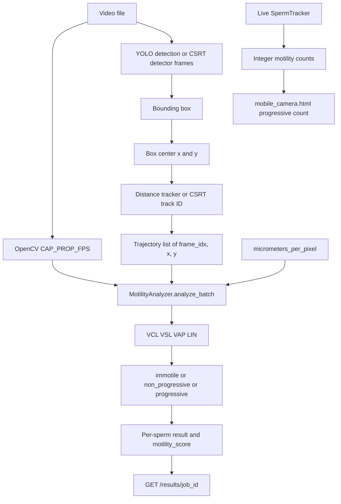

# Sperm Motility and CASA Calculation Documentation

This document describes the motility and CASA calculations that are currently implemented in this repository. It records what the code does. It does not change any formula, threshold, or configuration.

A separate note at the end compares this implementation with general CASA practice. That note is background, not a description of extra code.

## Executive summary

`MotilityAnalyzer` turns one sperm trajectory into curvilinear velocity (VCL), straight-line velocity (VSL), average-path velocity (VAP), linearity (LIN), and a label: `immotile`, `non_progressive`, or `progressive`. A track with fewer than 3 points is labeled `immotile` with reason `too_few_frames`.

The trajectory points are full-frame bounding-box centers, stored as `(frame_idx, x, y)` in pixels. They are not mask centroids and they are not sperm-head centroids. Before the velocities are calculated, each coordinate is multiplied by `micrometers_per_pixel`. Time is the frame-index span divided by the video frame rate.

Uploaded-video analysis classifies each track in `SpermAnalysisPipeline._compute_final_analysis`. The per-sperm record stores the label and the velocity dictionary in `motility_features`, plus a `motility_score` of `1.0`, `0.5`, or `0.0`.

For uploaded jobs, the canonical key is the same video-local `application_id` drawn on the inference video. High-confidence accepted inference boxes provide CASA bounding-box-center points; identity-only low-score support rows are excluded from velocity trajectories. In CSRT mode, the inference CSRT ID is exported as `application_id`. The separate YOLO analysis tracker IDs are diagnostic and do not key uploaded morphology, CASA, trajectories, or API `sperm_id` rows. Live camera tracking remains session-local.

Each uploaded inference run starts a fresh monotonic application identity registry with `identity_capacity=None`; this repository has no independent validated physical-cell count, so the registry is uncapped and IDs are never recycled. IDs without a safe association remain unlabeled/unresolved and do not enter the uploaded trajectory, CASA, morphology, or API result rows. Registry state, tracking-quality counts, and overlap contact sheets are written under the job's `meta/` directory. Quality counts describe accepted assigned observations, not a physical sperm count; fragmentation and switch flags are diagnostic heuristics, not ground-truth measurements.

This repository does not calculate Total Motility % or Progressive Motility %. It does not contain the WHO 2021 reference lines, the “BELOW WHO” status, or the percentage badges `-4.2%` and `-10.0%`. Those UI elements are marked **Not verified in backend/code**.

| Value | Where it is produced |
|---|---|
| VCL, VSL, VAP, LIN, label | Backend, `MotilityAnalyzer` |
| `motility_score`, per-sperm status | Backend, `_compute_final_analysis` |
| Total Motility %, Progressive Motility % | Not implemented in this repository |
| WHO 2021 `> 42%` and `> 30%`, badges, “BELOW WHO” | Not verified in backend/code |

## Input data

### Video and frame rate

`process_video` opens the file with OpenCV and reads:

- `total_frames` from `cv2.CAP_PROP_FRAME_COUNT`
- `fps` from `cv2.CAP_PROP_FPS`
- `width` and `height` from the capture properties

That `fps` value is passed into `_compute_final_analysis`. The analyzer does not read `meta/trajectories.json`; the exported trajectory metadata now records the same source-video FPS.

Frames are skipped when `frame_idx % frame_skip != 0`. The default `frame_skip` in `config.ini` is `1`, so every frame is processed. The stored frame index is the source-video index, not a renumbered analysis index.

### Track ID and coordinates

Each stored point is exactly:

```text
(frame_idx, x, y)
```

`frame_idx` is an integer. `x` and `y` are full-frame pixel coordinates.

The live-camera and diagnostic analysis passes may store centers in `SpermTracker` or `CSRTSpermTracker`. Uploaded CASA trajectories instead use the canonical inference `application_id` and the accepted detection bbox center:

```text
x = (x1 + x2) / 2
y = (y1 + y2) / 2
```

The default uploaded inference path uses the accepted Mask R-CNN/ByteTrack bbox associated with `application_id`. In uploaded CSRT mode, it uses the CSRT inference bbox under the same application ID. Both use the full-frame bounding-box-center formula.

CSRT also stores a segmentation mask and an optional mask centroid in `_masks` and `_mask_centroids`. `remember_mask` states that this storage is for later display and does not reinitialize CSRT. Those centroids are not written into `trajectories`.

Morphology computes a head centroid with `region.centroid` inside the head mask. That centroid is a morphology feature. It is not the point used for VCL, VSL, VAP, or LIN.

`motility_features['coordinate_source']` is the literal string `bounding_box_center_pixels`.

### Trajectory length

A trajectory is the list of points for one track ID, in the order they were appended. Before metrics are calculated, `_select_time_window` sorts that list by `frame_idx`.

Minimums in the uploaded-video path:

| Check | Value | Result |
|---|---|---|
| `min_frames_for_class` | 3 points | Fewer than 3 points: label `immotile`, reason `too_few_frames` |
| Points left after the time window | fewer than 2 | Label `immotile`, reason `insufficient_data` |
| Analysis window | last `window_seconds` of frame time | Default `1.0` second |

Distance tracks keep at most `max_trajectory_length` points (default `1000`). CSRT uses the same default from `CSRTConfig`. Live USB and WebSocket tracking use `SpermTracker(max_trajectory_length=500, max_match_distance=80.0)`.

Live counting uses different length gates from the uploaded-video analyzer. The USB loop and WebSocket `process_frame` classify only active tracks with at least 5 points. `get_motility_summary` classifies tracks with at least 3 points. Those gates only decide whether `analyze_motility` is called. Inside the analyzer, the class threshold remains 3 points.

### Calibration input

`micrometers_per_pixel` is optional. `main.py` reads it as follows:

1. Environment value from `_cfg("pipeline", "micrometers_per_pixel", "")`, which checks `SPERM_PIPELINE_MICROMETERS_PER_PIXEL` before `config.ini`.
2. If the string is empty, `MICROMETERS_PER_PIXEL` is `None`.
3. Otherwise it is parsed with `float` and passed into `SpermAnalysisPipeline`.

`config.ini` `[pipeline] micrometers_per_pixel` is blank. No measured microscope scale is stored in this repository. The system is not clinically calibrated by the files inspected here.

## FPS calculation / time

Uploaded-video CASA time uses the OpenCV frame rate:

```text
elapsed_time_s = (last_frame_index - first_frame_index) / fps
```

`last_frame_index` and `first_frame_index` are taken after the one-second window is applied. If those two indices are equal, the code uses:

```text
elapsed_time_s = 1 / fps
```

There is no 30 FPS fallback on this path. `_compute_final_analysis` raises `ValueError` when `fps` is missing, non-finite, or not positive. `MotilityAnalyzer._validated_fps` raises the same class of error. The message states that no 30 FPS fallback is applied.

A missing intermediate frame is not interpolated and is not given a point. The gap still increases elapsed time because time uses the frame-index difference. Example: points on frames 1 and 5 contribute `4 / fps` seconds, not one frame interval. The path length is still only the straight segment between the two stored points.

VCL, VSL, and VAP all divide a distance by this same `elapsed_time_s`. A higher FPS makes the same frame span a shorter time and therefore a higher velocity. A gap between stored points makes the same path length a lower velocity.

Other 30 FPS defaults exist and are not the uploaded-video CASA time base:

- `meta/trajectories.json` records the source video FPS
- `_identify_good_quality_sperm` calls `analyze_batch(..., 30.0)`. That function is not called by `process_video`.
- ByteTrack and video writers fall back to `30.0` when their own FPS argument is missing or not positive.

Live analysis passes `LiveStreamProcessor.target_fps`. That constructor default is `30`, and `config.ini` `[live] target_fps` is `30`. The live overlay’s `fps_actual` is the measured processing rate, `1 / elapsed`, and is not passed into `analyze_motility`.

## Pixel-to-micrometer calibration

When a positive scale is present, conversion happens in `analyze_motility` before `_calculate_motility_metrics`:

```text
x_um = x_pixel * micrometers_per_pixel
y_um = y_pixel * micrometers_per_pixel
```

The whole coordinate array is multiplied by the scale. Every later distance, including VCL path length, VSL displacement, and VAP path length, is therefore in micrometers. Dividing by seconds yields micrometers per second. `velocity_unit` is then `µm/s`.

`MotilityAnalyzer` does not supply a default scale.

| Scale value | Uploaded video | `analyze_motility` called directly |
|---|---|---|
| `None` or blank configuration | `_compute_final_analysis` raises `ValueError` and does not emit velocities | Label `unknown`, reason `missing_spatial_calibration`, velocities `None`, `velocity_unit` `None` |
| Non-positive or non-finite | Constructor raises `ValueError` | Constructor raises `ValueError` |
| Positive finite number | Coordinates are converted and velocities are `µm/s` | Same |

The blank `config.ini` value means a normal API video job does not currently receive a scale unless `SPERM_PIPELINE_MICROMETERS_PER_PIXEL` is set in the process environment. Pixel speeds are not relabeled as `µm/s` when the scale is missing.

`LiveStreamProcessor` constructs `MotilityAnalyzer()` with no scale. With the current code, live `analyze_motility` returns `unknown` / `missing_spatial_calibration` rather than `µm/s` or `px/s`.

## VCL — curvilinear velocity

After calibration, consecutive stored points `i` and `i+1` give:

```text
d_i = sqrt((x_(i+1) - x_i)^2 + (y_(i+1) - y_i)^2)
```

NumPy computes this as the Euclidean norm of `np.diff(coords, axis=0)`.

```text
L = sum(d_i)
VCL = L / elapsed_time_s
```

`L` is the sum of segments between points that remain after the time window. Points that were never stored, including frames skipped by a detector interval or a lost CSRT update, are not inserted. The unit is `µm/s` when a positive scale was applied. If `elapsed_time_s` is not greater than 0, VCL is `0.0`. With the current time formula, elapsed time is positive whenever FPS is valid.

## VSL — straight-line velocity

VSL uses the first and last points of the windowed, calibrated trajectory:

```text
D = sqrt((x_last - x_first)^2 + (y_last - y_first)^2)
VSL = D / elapsed_time_s
```

The unit is `µm/s` under the same scale rule as VCL. If fewer than two points remain, this calculation is not reached.

## VAP — average path velocity

VAP is an application-defined average path. The code comment states that it is not a universal CASA standard. The current smoother does not use `np.convolve` and does not zero-pad toward the origin.

Parameters:

- `vap_smooth_seconds` default `0.2`
- half window in frames: `(vap_smooth_seconds * fps) / 2`

For a trajectory of `N` calibrated points with frame indices `f_i`:

- If `N < 3`, the smoothed path is a copy of the measured points.
- Point 0 stays `(x_0, y_0)`.
- Point `N-1` stays `(x_last, y_last)`.
- For each interior index `i`, the smoothed point is the arithmetic mean of every observed point whose frame index satisfies `abs(f_j - f_i) <= half_window_frames`.

Only real samples inside that frame-time radius are averaged. The window is not a fixed point count, and missing frames are not filled with zeros.

The VAP distance is the sum of Euclidean segments on that smoothed path:

```text
L_vap = sum of distances between consecutive smoothed points
VAP = L_vap / elapsed_time_s
```

`elapsed_time_s` is the same frame-span time used by VCL and VSL. The unit is `µm/s` when the scale has been applied.

`path_deviation` is also returned. It is the mean Euclidean distance between each measured point and its smoothed point. It is not used by the classification function.

`motility_features['vap_method']` is `time_local_mean_fixed_endpoints`.

Short trajectories:

- Fewer than 3 original points never reach the smoother. They return `immotile` / `too_few_frames` with the default numeric velocities `0.0`.
- A window that leaves fewer than 2 points returns `immotile` / `insufficient_data` with velocities `0.0`.
- A 2-point path that passes the 3-point check cannot occur, because the check happens first. If the smoother is ever given fewer than 3 points, it returns those points unchanged, so VAP equals VCL for that path.

## LIN — linearity

```text
LIN = VSL / VCL    if VCL > 1e-6
LIN = 0.0          otherwise
```

`LIN` is a dimensionless ratio. `LIN_percent = LIN * 100` when LIN is not `None`. `linearity_unit` is `ratio`.

When calibration is missing and `analyze_motility` returns early, both `LIN` and `LIN_percent` are `None`.

Numerical illustration, using the worked example below: VSL `178.0449` and VCL `181.1133` give LIN `0.983058` and `LIN_percent` `98.3058`.

## Motility classification

`_classify_motility` evaluates the calibrated metrics in this order. VSL is read from the metrics dictionary and is not used in a condition.

| Order | Condition | Classification | Reason field |
|---|---|---|---|
| Before metrics, fewer than 3 points | `len(trajectory) < min_frames_for_class` (`3`) | `immotile` | `too_few_frames` |
| After the time window, fewer than 2 points | `len(coords_px) < 2` | `immotile` | `insufficient_data` |
| 1 | `net_displacement < 2.0` and `VCL < 5.0` | `immotile` | no `reason` key |
| 2 | `VCL >= 5.0` and `LIN >= 0.7` | `progressive` | no `reason` key |
| 3 | every remaining case | `non_progressive` | no `reason` key |
| No positive scale, direct analyzer call | calibration missing | `unknown` | `missing_spatial_calibration` |

Current project thresholds, from `MotilityAnalyzer.__init__` defaults:

| Name | Value | Code comment on its unit |
|---|---|---|
| `min_frames_for_class` | `3` | minimum points |
| `immobile_disp_threshold` | `2.0` | historical displacement cutoff in pixels |
| `speed_threshold` | `5.0` | historical speed cutoff in pixels/second |
| `linearity_threshold` | `0.7` | LIN ratio |
| `window_seconds` | `1.0` | seconds of frame time |
| `vap_smooth_seconds` | `0.2` | seconds |

`classification_threshold_unit` is the string `legacy_px_and_px_per_s`.

Current project threshold — not independently interpreted as a WHO threshold.

The displacement and speed numbers are applied to the values after micrometer conversion. The code does not multiply `2.0` or `5.0` by `micrometers_per_pixel`, and it does not convert them into separate micrometer cutoffs. The source comments state that these cutoffs are not `µm/s` clinical thresholds and are not WHO cutoffs.

## Per-sperm motility score

`_compute_final_analysis` assigns `motility_score` from the label:

| Label | `motility_score` |
|---|---|
| `progressive` | `1.0` |
| `non_progressive` | `0.5` |
| `immotile`, including `too_few_frames` and `insufficient_data` | `0.0` |
| any other label, including `unknown` | `0.0` |

The score is not computed inside `MotilityAnalyzer`. No other normalization is applied.

Overall `status` is separate from the score:

```text
status = 'good' if morphology status is 'normal' and label is 'progressive' else 'defective'
```

Morphology status is `normal` when the median morphology score is greater than `0.5`. Otherwise it is `defective`. A progressive track with no morphology data is `defective`.

`_identify_good_quality_sperm` uses the same morphology median and the same progressive requirement, but it calls the analyzer with a hardcoded `30.0` FPS. `process_video` does not call this function.

## Per-sperm result structure

`_compute_final_analysis` returns one dictionary per canonical uploaded application ID with a high-confidence trajectory. Tracks are not removed for being short. The API `GET /results/{job_id}` returns that list as `results`; each `sperm_id` equals the `application_id` drawn on the inference video.

Each item contains:

| Field | Content |
|---|---|
| `sperm_id` | canonical uploaded `application_id` |
| `status` | `good` or `defective` |
| `morphology_score` | median morphology score, or `0.0` |
| `motility_score` | `1.0`, `0.5`, or `0.0` |
| `morphology_features` | median head and tail features |
| `motility_features` | the full analyzer dictionary |
| `head_length`, `head_width`, `head_circularity`, `tail_length`, `neck_angle_deg` | flattened morphology medians |
| `explainability.morphology` | morphology reason strings |
| `explainability.motility` | a one-item list containing the motility label, or `unknown` if the label is absent |

`motility_features` fields from `_result`:

| Field | Meaning |
|---|---|
| `VCL`, `VSL`, `VAP` | velocities, or `None` when calibration is missing on a direct call |
| `LIN` | ratio, or `None` |
| `LIN_percent` | `LIN * 100`, or `None` |
| `path_deviation` | mean distance from the measured path to the smoothed path |
| `label` | classification string |
| `reason` | present for `too_few_frames`, `insufficient_data`, or `missing_spatial_calibration` |
| `velocity_unit` | `µm/s`, or `None` |
| `linearity_unit` | `ratio` |
| `coordinate_source` | `bounding_box_center_pixels` |
| `micrometers_per_pixel` | the scale used, or `None` |
| `elapsed_time_s` | frame-span seconds, or `None` on the early returns |
| `vap_method` | `time_local_mean_fixed_endpoints` |
| `classification_threshold_unit` | `legacy_px_and_px_per_s` |

The trajectory itself is not copied into the per-sperm result. It is saved separately in `meta/trajectories.json` as `(frame_idx, x, y)` pixel points, with the file-level `fps` set to the source video FPS.

`meta/summary.csv` stores `sperm_id`, `status`, `morphology_score`, `motility_score`, `morphology_issues`, and `motility_issues`. The CSV motility column is the label string. It does not contain VCL, VSL, VAP, or LIN.

Live `get_motility_summary` returns `total_tracked`, `motility_counts`, and `per_sperm`. It does not return sample percentages.

## Total Motility %

**Not implemented in this repository.**

No backend or frontend file computes:

```text
(progressive + non_progressive) / total_valid_sperm * 100
```

or any other Total Motility percentage. Searches for “Total Motility”, sample percentage formulas, and WHO comparison text found no implementation.

What the code does return is a per-sperm label and, on the live path, integer counts:

```text
motility_counts = {
    "progressive": count,
    "non_progressive": count,
    "immotile": count
}
```

A label of `unknown` is not added to those counts. With the current live analyzer, missing calibration produces `unknown`, so the live counts stay at zero even when tracks are long enough to be submitted.

The uploaded-video result list includes every track, including `too_few_frames` tracks labeled `immotile`. The code does not then divide any of those counts by a sample size.

## Progressive Motility %

**Not implemented in this repository.**

No file computes:

```text
progressive_sperm / total_valid_sperm * 100
```

`static/mobile_camera.html` displays `data.motility.progressive` in the element `statProgressive`. That value is the integer count from the live stats payload, not a percentage. The page does not divide it by `total_tracked`.

## Relationship between total and progressive motility

The repository does not calculate Total Motility, Progressive Motility, or Non-progressive Motility as percentages, so it does not enforce:

```text
Total Motility % = Progressive Motility % + Non-progressive Motility %
```

The live count buckets are separate integers. A sperm is placed in at most one bucket, and only when its label is one of the three count keys. That partition is a count, not a percentage identity implemented by the UI.

The following arithmetic is an illustration of a percentage definition that this repository does not execute. It is not sample data.

```text
100 tracks
8 progressive
12 non_progressive
80 immotile

Progressive count / 100 * 100 = 8
(progressive + non_progressive) / 100 * 100 = 20
```

## UI card calculations

The only frontend file in this repository is `static/mobile_camera.html`. It shows four numbers:

| UI element | Source | Calculation in the page |
|---|---|---|
| Tracked | `data.total_tracked` | displayed as received, default `0` |
| Active | `data.active_count` | displayed as received, default `0` |
| Progressive | `data.motility.progressive` | displayed as received, default `0` |
| FPS | `data.fps_actual` | displayed as received, default `0` |

`fps_actual` is the live processing rate, not the CASA FPS. The page applies no rounding of its own, no reference value, no comparison, no status text, and no progress bar.

`pipeline.py` comments that flattened morphology fields are expected by `templates/index.html`. That template is not present in this repository.

The described dashboard cards are **Not verified in backend/code**:

| UI element | Repository result |
|---|---|
| TOTAL MOTILITY `20.0%` | Not verified in backend/code |
| PROGRESSIVE MOTILITY `8.0%` | Not verified in backend/code |
| WHO 2021 `> 42%` | Not verified in backend/code |
| WHO 2021 `> 30%` | Not verified in backend/code |
| Red badge `-4.2%` | Badge calculation could not be verified from the current repository. |
| Red badge `-10.0%` | Badge calculation could not be verified from the current repository. |
| Progress-bar values for those cards | Not verified in backend/code |

`20 - 42` and `8 - 30` are not formulas found in this repository, and they do not equal `-4.2` or `-10.0`. No alternative badge formula was found.

## WHO 2021 reference values

**Not verified in backend/code.**

No file contains `WHO 2021`, `42%`, `30%` as motility reference text, or a configuration key for those reference values. They are not inputs to VCL, VSL, VAP, LIN, or `_classify_motility`.

Project classification thresholds and any external WHO reference display are separate. The project thresholds are `2.0`, `5.0`, and `0.7`, and the code comments say they are not WHO cutoffs.

## BELOW WHO status

**Not verified in backend/code.**

No condition of the form `calculated_total_motility < reference_total_motility` exists in the inspected Python, HTML, or configuration. The backend status strings for a sperm are `good` and `defective`.

## All formulas in one table

| Metric | Formula | Input | Unit | Code location |
|---|---|---|---|---|
| Point distance | `sqrt((x2-x1)^2 + (y2-y1)^2)` after `coords * micrometers_per_pixel` | windowed trajectory | µm | `MotilityAnalyzer._calculate_motility_metrics` |
| Elapsed time | `(last_frame - first_frame) / fps`, or `1/fps` when the span is 0 | frame indices, video FPS | s | `_calculate_motility_metrics` |
| VCL | `sum(segment lengths) / elapsed_time_s` | calibrated points | µm/s | `_calculate_motility_metrics` |
| VSL | `distance(first, last) / elapsed_time_s` | calibrated endpoints | µm/s | `_calculate_motility_metrics` |
| VAP | smoothed-path length / `elapsed_time_s` | time-local mean, fixed endpoints, half window `(0.2 * fps) / 2` frames | µm/s | `_smooth_average_path`, `_calculate_motility_metrics` |
| LIN | `VSL / VCL` if `VCL > 1e-6`, else `0` | VSL, VCL | ratio | `_calculate_motility_metrics` |
| LIN percent | `LIN * 100` | LIN | percent number | `_result` |
| Total Motility % | Not implemented | — | — | — |
| Progressive Motility % | Not implemented | — | — | — |

## Complete numerical example

This is an illustrative example, not a patient or sample measurement. The scale is set to `1.0` so that one pixel equals one micrometer for the arithmetic. The repository configuration does not contain `1.0`.

```text
fps = 30
micrometers_per_pixel = 1.0

Frame 0 → (100, 100)
Frame 1 → (103, 104)
Frame 2 → (108, 108)
Frame 3 → (114, 111)
```

1. Frame interval used by the time base: `1 / 30` second. The code does not multiply by that interval directly. It divides the index span by FPS.
2. Window: earliest frame = `3 - (1.0 * 30) = -27`. All four points are kept.
3. Elapsed time: `(3 - 0) / 30 = 0.1` second.
4. Segment distances:
   - frame 0 to 1: `sqrt(3^2 + 4^2) = 5`
   - frame 1 to 2: `sqrt(5^2 + 4^2) = sqrt(41) = 6.403124`
   - frame 2 to 3: `sqrt(6^2 + 3^2) = sqrt(45) = 6.708204`
5. Curvilinear distance: `18.111328` µm.
6. VCL: `18.111328 / 0.1 = 181.113282` µm/s.
7. Straight-line displacement: `sqrt(14^2 + 11^2) = sqrt(317) = 17.804494` µm.
8. VSL: `17.804494 / 0.1 = 178.044938` µm/s.
9. Smoothed path. Half window = `(0.2 * 30) / 2 = 3` frames, so each interior point averages all four observed points. Endpoints stay fixed.
   - frame 0: `(100, 100)`
   - frame 1: `(106.25, 105.75)`
   - frame 2: `(106.25, 105.75)`
   - frame 3: `(114, 111)`
10. VAP segments: `8.492644`, `0`, `9.360823`. VAP length `17.853466` µm. VAP = `178.534665` µm/s.
11. LIN: `178.044938 / 181.113282 = 0.983058`. `LIN_percent = 98.305843`.
12. Classification: net displacement `17.804494` is not below `2.0`, so the immotile pair of conditions fails. VCL is at least `5.0` and LIN is at least `0.7`, so the label is `progressive`.
13. `motility_score` from the pipeline rule: `1.0`.

The same four points with a blank scale do not produce these velocities on the uploaded-video path. `_compute_final_analysis` raises before analysis.

### Sample-level illustration

This percentage arithmetic is not executed by the repository.

```text
Total tracks in the illustration = 100
Progressive = 8
Non-progressive = 12
Immotile = 80

Progressive Motility = 8 / 100 * 100 = 8%
Total Motility = (8 + 12) / 100 * 100 = 20%
```

## Data flow diagram



The diagram stops at per-sperm results and live counts. Sample percentages, WHO comparison, and badge display are not part of the implemented flow.

## Current limitations

These statements follow from the files inspected.

- Trajectory `x` and `y` are bounding-box centers. The morphology head centroid and the CSRT mask centroid are not the CASA coordinates.
- `config.ini` has a blank `micrometers_per_pixel`. No measured microscope calibration value is stored in the repository.
- Without a positive scale, uploaded-video analysis raises. It does not report `px/s` under the name `µm/s`.
- With a positive scale, distances are micrometers, but `immobile_disp_threshold = 2.0` and `speed_threshold = 5.0` remain the historical numeric cutoffs. The code labels their unit `legacy_px_and_px_per_s`.
- Classification needs at least 3 stored points. The metrics window then keeps points from the last `1.0` second of frame time.
- VAP is the time-local mean described above, with fixed endpoints and no zero padding. It is marked in code as application-defined.
- STR, WOB, ALH, and BCF do not appear in the repository. They are not implemented.
- Total Motility % and Progressive Motility % are not implemented. Live output provides counts.
- `mobile_camera.html` displays the live progressive count. It does not display the uploaded-video `motility_features`.
- WHO reference text and the `-4.2%` / `-10.0%` badges are not in this repository.
- `trajectories.json` records the source `CAP_PROP_FPS` value.
- Live motility calls `MotilityAnalyzer()` with no scale, so those calls currently return `unknown` rather than a velocity class.
- `_identify_good_quality_sperm` hardcodes `30.0` FPS and is not used by `process_video`.

## Implementation status table

| Component | Status | Evidence |
|---|---|---|
| VCL | Implemented | `motility.py`, `MotilityAnalyzer._calculate_motility_metrics` |
| VSL | Implemented | same function |
| VAP | Implemented | `_smooth_average_path` and `_calculate_motility_metrics` |
| LIN | Implemented | `_calculate_motility_metrics` and `_result` |
| Classification | Implemented | `_classify_motility`; thresholds `2.0`, `5.0`, `0.7`, minimum 3 points |
| `motility_score` | Implemented | `pipeline.py`, `_compute_final_analysis` |
| Total Motility % | Not implemented | no formula in Python, HTML, or config |
| Progressive Motility % | Not implemented | live path returns a count; `mobile_camera.html` displays that count |
| WHO comparison | Not verified in backend/code | no WHO reference values in the repository |
| UI badge calculation | Not verified in backend/code | `-4.2%` and `-10.0%` are absent |
| Calibration | Implemented as a required positive scale; no measured value is configured | `main.py`, `config.ini` `[pipeline] micrometers_per_pixel` is blank |

## Implementation vs Standard CASA — Notes

This section is general background. It is not additional behavior of the program.

Standard CASA systems usually report VCL, VSL, VAP, and LIN from a tracked sperm-head position, in micrometers per second, using a microscope calibration for the objective and camera. They often also report STR (`VSL / VAP`), WOB (`VAP / VCL`), ALH, and BCF. Sample reports often include percentages of progressive and total motile sperm against a laboratory reference.

In this repository, only VCL, VSL, VAP, and LIN are implemented, the tracked point is the box center, STR/WOB/ALH/BCF are absent, sample percentages are absent, and the classification numbers `2.0`, `5.0`, and `0.7` are project thresholds rather than values the code identifies as WHO limits.
